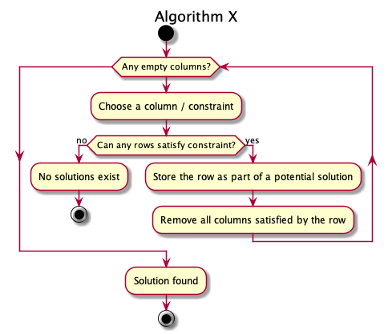

# Sudoku Solver

# Details
 
## General

This uses Knuth's implementation of [Algorithm X](https://en.wikipedia.org/wiki/Algorithm_X) - known as [Dancing Links (DLX)](https://en.wikipedia.org/wiki/Dancing_Links)

## Algorithm X

Algorithm X is an algorithm to find solutions to an [Exact Cover](https://en.wikipedia.org/wiki/Exact_cover) problem.




### Exact Cover Problems

#### Overview

To understand Algorithm X, it's necessary to understand what an Exact Cover problem is.

An Exact Cover is a set of **choices** and ***constraints*. The aim is to satisfy all constraints, using exactly one choice. There may be multiple solutions.

Some examples of Exact Cover problems include:

 - [Sudoku](https://en.wikipedia.org/wiki/Sudoku)
 - [N Queens](https://en.wikipedia.org/wiki/Eight_queens_puzzle)
 - [Tiling / Tessellation](https://en.wikipedia.org/wiki/Tessellation)

#### Modelling

An Exact Cover problem can be modelled as a table, with:

- Constraints represented by columns 
- Choices represented by rows
- Satisfied constraints represented with an `X` (For a given row/column pair)
 
This is similar to a Sudoku puzzle - and a Sudoku can be treated as an Exact Cover problem


It has the following qualities:

- [Recursive](https://en.wikipedia.org/wiki/Recursion_(computer_science))
- [Non-deterministic](https://en.wikipedia.org/wiki/Nondeterministic_algorithm)
- [Depth-first](https://en.wikipedia.org/wiki/Depth-first_search)
- [Backtracking](https://en.wikipedia.org/wiki/Backtracking)

### [Dancing Links (DLX)](http://www.ocf.berkeley.edu/~jchu/publicportal/sudoku/0011047.pdf)

Dancing Links is an **efficient** implementation of Algorithm X. The efficiency stems from the fact that a node in a [doubly-linked list](https://en.wikipedia.org/wiki/Doubly_linked_list) can be reinserted in `O(1)` (instead of `O(n)`, in the naive approach).

This can be demonstrated via the following pseudo-code.

```text
// Removing a Node
x.left.right ← x.right;
x.right.left ← x.left;
//  Adding it back (Assuming 'x' is unchanged):
x.left.right ← x;
x.right.left ← x;
```

